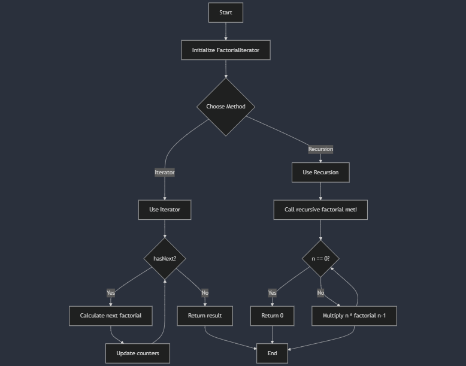

# Tasks for Homework and Assignment 17: Date of Start: Sept 17
## Concepts
- Understand the recursion use in the fibonacci sequence and the factorial sequence in java.

## Assignment 17 Task 1 Fibonacci Sequence
1. Get position n from the user
2. Calculate the nth number in the fibonacci sequence
3. Display the result
### Methods of comparsion
- Use iterator and recursive method and compare and contrast.

## Task 2 Factorial Sequence using Iterator Interface and Recursive methods
### Description :
- Flowchart of the java code that impliements the recursive method for factorial sequence as well as iterator interface for factorial sequence.

