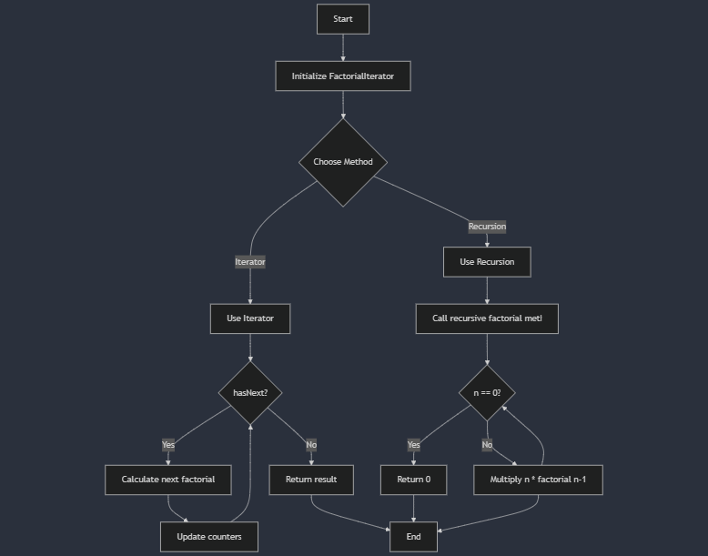

**Understand the recursion use in the fibonacci sequence and the factorial sequence in java.**

## Example of factorial sequence using flowchart of recursion vs iterator
```png

```

**Get position n from the user**
**Calculate the nth number in the fibonacci sequence**
**Display the result**

**Use iterator and recursive method and compare and contrast.**
```png


```

